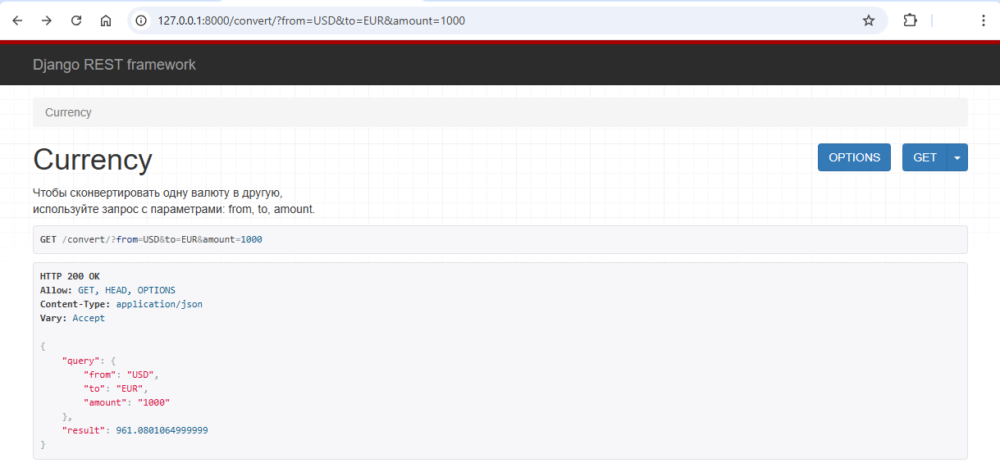
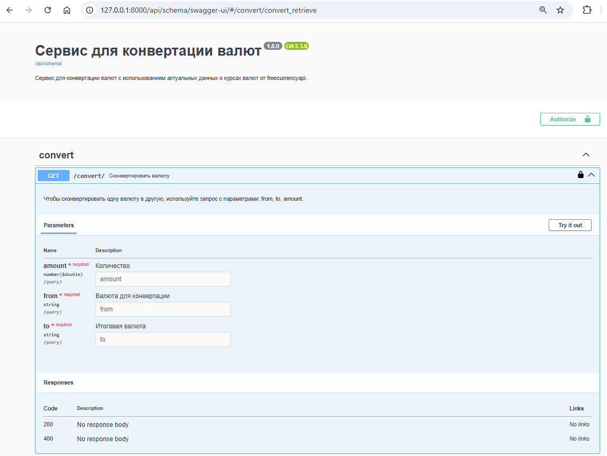

# Проект: 
Сервис для конвертации валют.  

## Содержание
- [Технологии](#технологии)
- [Запуск проекта](#запуск-проекта)
- [Структура проекта](#структура-проекта)
- [Тестирование проекта](#тестирование-проекта)
- [Развёртывание](#развёртывание)


## Технологии:
### Frontend
ДОПИСАТЬ

### Backend
Python + Django REST Framework + drf-spectacular + Redis + Celery + Nginx + Docker + GitHub Actions + Gunicorn


## Локальный запуск проекта
1. Склонируйте проекта с git-репозитория 
```bash
git clone https://github.com/hackathon-team-2/currency-converter-backend.git
```
2. Используйте .env.example и сделайте свой .env. 
APIKEY-токен можно получить здесь - https://freecurrencyapi.com/                
Учтите, что DB_HOST в .env должен совпадать с названием сервиса postgres_db в docker-compose

3. В терминал для запуска выполните команду:

```bash
docker compose up --build  
```

4. В отдельном терминале из корневой директории проекта выполните команды:
```
docker compose exec backend python manage.py migrate
docker compose exec backend python manage.py collectstatic
docker compose exec backend sh -c 'cp -r /app/collected_static/. /backend_static/static/'
```

5. Для создания админа выполните команду:
```
docker compose exec backend python manage.py createsuperuser
```

6. Проект станет доступен по ссылке http://127.0.0.1:8000/api/convert/?from=USD&to=EUR&amount=1000  


7. Подробное описание станет доступно по ссылке http://127.0.0.1:8000/schema/swagger-ui/  


8. Админка станет доступна по адресу http://127.0.0.1:8000/admin/


## Структура проекта

### Приложение api - сервис для конвертации валюты
- Вью для get-запроса и обработки параметров  
- Сериализатор для проверки параметров: наличие, соответствие    

Запрос:  
```python
http://127.0.0.1:8000/api/convert?from=USD&to=RUB&amount=25000
```
  
Ответ:  
```python
{
  "query": {
    "from": "USD",
    "to": "RUB",
    "amount": 25000
   },
  "result": 2590593.3413124997
}  
```
Примеры для тестирования сервиса:  
http://127.0.0.1:8000/api/convert?from=USD&to=EUR&amount=100  
http://127.0.0.1:8000/api/convert?from=rub&to=USD&amount=100  
http://127.0.0.1:8000/api/convert?from=RUB&to=eur&amount=100  
http://127.0.0.1:8000/api/convert?from=rub&to=qqq&amount=100  
http://127.0.0.1:8000/api/convert?from=RUB&to=qqq&amount=100 


### freecurrencyapi сервис - сторонний сервис
Реализация в файле api/external_currency/freecurrencyapi.py  
Чтобы протестировать работу сервиса, допишите в конце файла:  
```python
if __name__ == '__main__':
    result = convert('RUB', 'EUR', 10000)
    print(result)
```
Запустите файл.

Документация на сервис - https://freecurrencyapi.com/docs/  
Для подключения нужен apikey, бесплатный тариф имеет ограничения: "5k Free Monthly Requests + 32 World Currencies + All exchange rates are updated on a daily basis".  

### Конфиг для логирования
/api/external_currency/config.py

## Разворачивание проекта на удаленном сервере:
### Выполненные задачи для настройки сервера:
**Установить на сервере Docker, Docker Compose, Nginx и certbot:**
```
sudo apt update
sudo apt install curl                                   - установка утилиты для скачивания файлов
curl -fsSL https://get.docker.com -o get-docker.sh      - скачать скрипт для установки
sh get-docker.sh                                        - запуск скрипта
sudo apt-get install docker-compose-plugin              - последняя версия docker compose
sudo apt install nginx                                  - установка nginx
sudo systemctl start nginx                              - запуск nginx
sudo apt install snapd                                  - установка пакетного менеджера snap.
sudo snap install core; sudo snap refresh core          - установка и обновление зависимостей для пакетного менеджера snap
sudo snap install --classic certbot                     - установка certbot
sudo ln -s /snap/bin/certbot /usr/bin/certbot           - создание ссылки на certbot в системной директории для админа

```
**Создать на сервере директорию converter:**
```
mkdir converter
```

**Для работы с GitHub Actions необходимо в репозитории в разделе Secrets > Actions создать переменные окружения:**
```
DOCKER_PASSWORD         - пароль от Docker Hub
DOCKER_USERNAME         - логин Docker Hub
HOST                    - публичный IP сервера
USER                    - логин пользователя на сервере
SSH_KEY                 - приватный ssh-ключ
SSH_PASSPHRASE          - пароль для ssh-ключа
TELEGRAM_TO             - ID телеграм-аккаунта для посылки сообщения
TELEGRAM_TOKEN          - токен бота, посылающего сообщение
```
**На сервере в директории converter создать файл .env и внести туда следующие данные:**
```
POSTGRES_DB             - имя бд
POSTGRES_USER           - имя пользователя бд
POSTGRES_PASSWORD       - пароль от бд
DB_HOST                 - postgres_db
DB_PORT                 - 5432
SECRET_KEY              - ваш секретный ключ от приложения
``` 
**На сервере настроить nginx:**
1. На сервере в редакторе nano откройте конфиг Nginx:
```
sudo nano /etc/nginx/sites-enabled/default
```
2. Замените весь код на ваш:
```
server {
    listen 80;
    index index.html;
    server_tokens off;
    server_name currency-converter.hopto.org;
    server_name currency-converter-livid-alpha.vercel.app;

    location / {
        proxy_set_header Host $http_host;
        proxy_pass http://127.0.0.1:8000;
    }
}
```
3. Убедитесь, что в конфиге нет ошибок и перезапустите nginx:
```
sudo nginx -t
sudo service nginx reload
```
4. Получите ssl сертификат:
```
sudo certbot --nginx
sudo nginx -t
sudo service nginx reload
```
**Склонируйте репозиторий:**
```
git clone https://github.com/hackathon-team-2/currency-converter-backend.git
```
### После каждого обновления репозитория (push в ветку main) будет происходить:

1. Проверка кода на соответствие стандарту PEP8 (с помощью пакета flake8)
2. Сборка и доставка докер-образов backend и gateway на Docker Hub
3. Разворачивание проекта на удаленном сервере
4. Отправка сообщения в Telegram в случае успеха

Проект доступен по адресу: https://currency-converter.hopto.org/schema/swagger-ui/