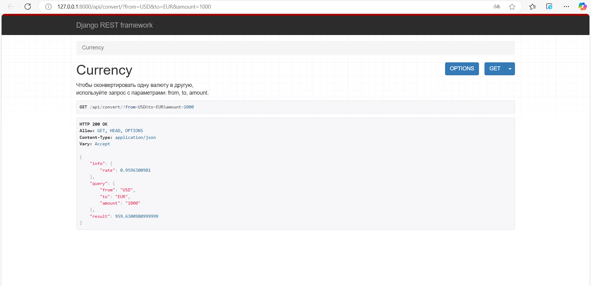
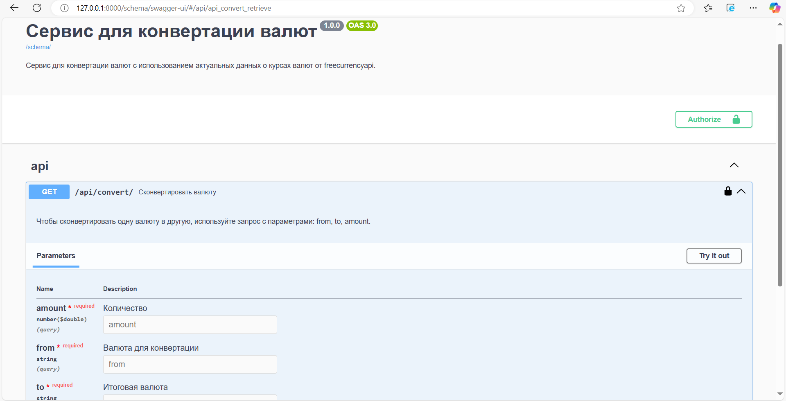

# Проект: 
Сервис для конвертации валют.  

## Содержание
- [Технологии](#технологии)
- [Запуск проекта](#запуск-проекта)
- [Структура проекта](#структура-проекта)
- [Тестирование проекта](#тестирование-проекта)
- [Развёртывание](#развёртывание)


## Технологии:
### Frontend
ДОПИСАТЬ

### Backend
Python + Django REST Framework + drf-spectacular + Redis + Celery + Nginx + Docker + GitHub Actions 


## Локальный запуск проекта
1. Склонируйте проекта с git-репозитория 
```bash
git clone https://github.com/hackathon-team-2/currency-converter-backend.git
```
2. Используйте .env.example и сделайте свой .env. 
APIKEY-токен можно получить здесь - https://freecurrencyapi.com/                
Учтите, что DB_HOST в .env должен совпадать с названием сервиса postgres_db в docker-compose

3. В терминал для запуска выполните команду:

```bash
docker compose up --build  
```

4. В отдельном терминале из корневой директории проекта выполните команды:
```
docker compose exec backend python manage.py migrate
docker compose exec backend python manage.py collectstatic
docker compose exec backend cp -r /app/collected_static/. /backend_static/static/ 
```

5. Для создания админа выполните команду:
```
docker compose exec backend python manage.py createsuperuser
```

6. Проект станет доступен по ссылке http://127.0.0.1:8000/api/convert/?from=USD&to=EUR&amount=1000  


7. Подробное описание станет доступно по ссылке http://127.0.0.1:8000/api/schema/swagger-ui/  


8. Админка станет доступна по адресу http://127.0.0.1:8000/admin/


## Структура проекта

### Приложение api - сервис для конвертации валюты
- Вью для get-запроса и обработки параметров  
- Сериализатор для проверки параметров: наличие, соответствие    

Запрос:  
```python
http://127.0.0.1:8000/api/convert?from=USD&to=RUB&amount=25000
```
  
Ответ:  
```python
{
  "query": {
    "from": "USD",
    "to": "RUB",
    "amount": 25000
   },
  "result": 2590593.3413124997
}  
```
Примеры для тестирования сервиса:  
http://127.0.0.1:8000/api/convert?from=USD&to=EUR&amount=100  
http://127.0.0.1:8000/api/convert?from=rub&to=USD&amount=100  
http://127.0.0.1:8000/api/convert?from=RUB&to=eur&amount=100  
http://127.0.0.1:8000/api/convert?from=rub&to=qqq&amount=100  
http://127.0.0.1:8000/api/convert?from=RUB&to=qqq&amount=100 


### freecurrencyapi сервис - сторонний сервис
Реализация в файле api/external_currency/freecurrencyapi.py  
Чтобы протестировать работу сервиса, допишите в конце файла:  
```python
if __name__ == '__main__':
    result = convert('RUB', 'EUR', 10000)
    print(result)
```
Запустите файл.

Документация на сервис - https://freecurrencyapi.com/docs/  
Для подключения нужен apikey, бесплатный тариф имеет ограничения: "5k Free Monthly Requests + 32 World Currencies + All exchange rates are updated on a daily basis".  

### Конфиг для логирования
/api/external_currency/config.py

## Тестирование
Для тестирования используется библиотека pytest. Чтобы запустить тесты, перейдите в папку 
```python
cd currency_converter/api/pytest_tests/
```
и выполните команду:
```python
pytest
```


## Тестирование
Для тестирования используется библиотека pytest. Чтобы запустить тесты, перейдите в папку 
```python
cd currency_converter/api/pytest_tests/
```
и выполните команду:
```python
pytest
```

## Развёртывание на сервере
Для развёртывания на сервере создан файл ...  
Дописать про action CI/CD  
